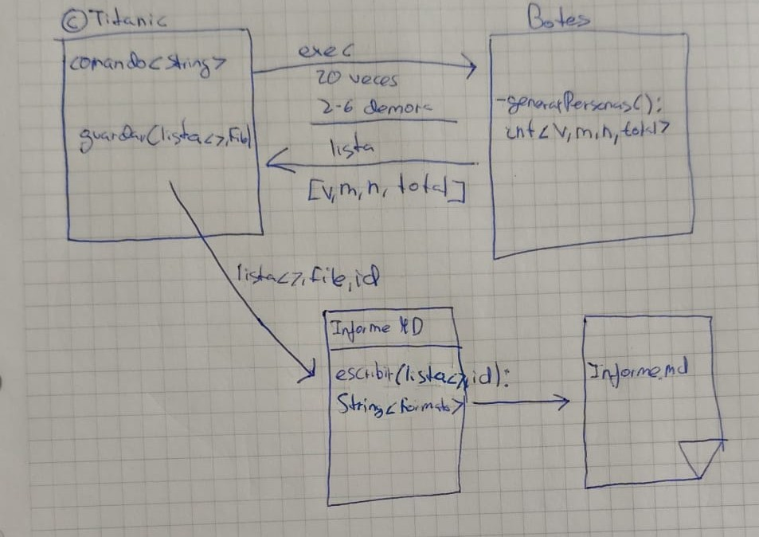

# TITANIC Documentación
 Trabajo realizado por Alexis Rodríguez y Daniel Herrero
## INDICE

1. Análisis del problema
2. Diseño de la solución
    - Arquitectura
    - Componentes
    - Protocolo de comunicaciones
    - Plan de pruebas
3. Manual de usuario
4. Elementos destacables del desarrollo
5. Problemas encontrados
6. Conclusiones individuales
7. Anexos

## 1. Análisis del problema
Se han lanzado 20 botes salvavidas del Titanic con el fin de salvar gente pero solo caben un máximo de 100 personas por bote. Ahora no se sabe cuántos supervivientes hay ni como se clasifican.
## 2. Diseño de la solución
### Arquitectura:
Generar un informe con los datos enviados de cada bote clasificándolos en varones mujeres y niños sacando un total por bote y general
<p align="center">

</p>

### Componentes:
Emplearemos una clase Titanic para desplegar los 20 botes y recoger su información. Los botes generarán aleatoriamente tres números procurando que la suma no pase de 100 (Esto mediante restar los números nuevos con los que ya hayan salido). Después el Titanic generará un informe en markdown con los datos recibidos dando el total de cada bote y un total general de todo
<p align="center">

</p>

### Protocolo de comunicación:
El Ttitanic recibe cierta información de los botes en forma de array. Esta información es el número de varones, mujeres y niños que hay por bote la cual luego puede clasificar y escribir
### Plan de pruebas:
El objetivo de las pruebas hechas es que se pueda testear el proyecto sin necesidad de ejecutarlo para ver que todo funciona. Nuestras pruebas concretamente, vigilan que cuando se genera el informe lo haga con los datos correctos, que el Titanic ejecute Botes correctamente y estos devuelvan los números bien y que el Titanic parsee los datos correctamente
## 3. Manual de usuario
### Requisitos:
- Tener instalado el JDK
- Tener acceso a la cmd o un entorno de desarrollo
### Cómo ejecutarlo:
- Con entorno de desarrollo:
    1. Abre en el entorno la carpeta con el proyecto
    2. Úbicate en el archivo `Titanic.java`
    3. Haz click en el icono de ejecutar en la esquina superior derecha de la pantalla
- Con la cmd:
    1. Dirígete a la carpeta del proyecto
    2. Compila el programa con ```javac Titanic.java```
    3. Ejecuta el programa con ```java Titanic```
### Qúe debería pasar:
- Comprueba que te aparece que los botes se están desplegando
- Una vez se hayan desplegado los 20 botes, comprueba que se te haya generado un informe
- Dicho informe tendrá que tener el número de supervivientes por bote y su clasificación y al final del informe el número total de supervivientes.
### Cómo ejecutar los test:
- En la cmd:
    1. Compila todo el proyecto
    2. Ejecuta los archivos ``InformeMarkdownTest.java``,``TitanicMockTest.java`` y ``TitanicTest.java``
- En el entorno de desarrollo:
    1. Vete a la pestaña de Testing a la izquierda de la pantalla
    2. Te apareceran los diferentes test del proyecto
    3. Ejecuta cada uno pulsando el botón de play
## 4. Elementos destacables del desarrollo
- Para que el Titanic usara bien la información recibida de los botes la hemos tenido que parsear con un método
- Para poder escribir las IDs de los botes hemos usado el formato en una constante TXT_BOTES
- Hemos intentado meterlo todo en métodos y constantes para evitar el hardcode
- Hemos usado una interfaz GeneradorInforme para que en el futuro se puedan generar otros tipos de informe en lugar de markdown
- A partir de la interfaz ya mencionada, hemos hecho la clase InformeMakdown que va escribiendo el informe generado después por el Titanic
## 5. Problemas encontrados
- Tuvimos un problema al inicio del trabajo porque no encontraba la clase Botes para lanzarla. Eso dio lugar a errores con el paquete que nos llevó a tener que volver a empezar el proyecto más de una vez
- También hemos tenido erreres de paquetería en los test
- Nos costó evitar el hardcode debido a que no encontrábamos como quitar código dupicado sin tener más líneas
- Nos costó ponernos de acuerdo al principio para ver como hacer que los botes no diesen más de 100 personas
## 6. Conclusiones individuales
#### Daniel Herrero:
> Ha sido un trabajo algo complicado en un primer vistazo ya que no sabíamos bien como empezar pero tras arreglar los fallos extraños que nos daba en ciertos momentos creo que fue más fácil de entender
#### Alexis Rodríguez:
> Gracias a este trabajo he aprendido a tener una mentalidad más flexible, dos mentes piensan mejor que una. Este trabajo al principio hemos tenido problemas y gran parte del tiempo se ha invertido ahí.
El proyecto ha sido entretenido y como equipo fue bastante gratificante.  

## 7. Anexos
#### URL GitHub:
https://github.com/RODRIGAMER669/titanic2.git